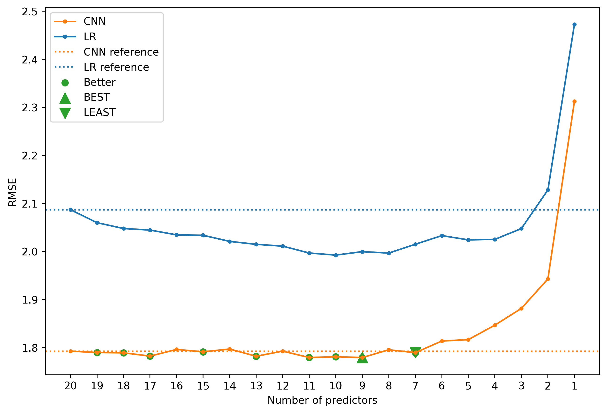
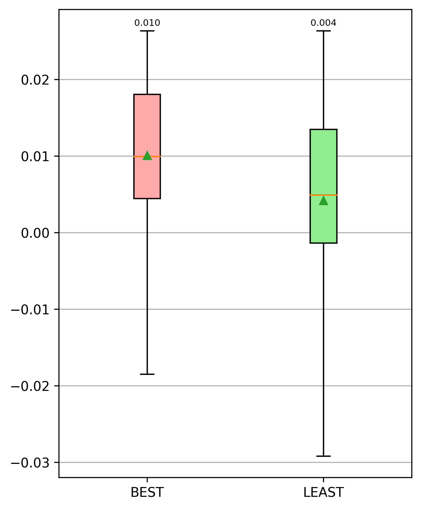
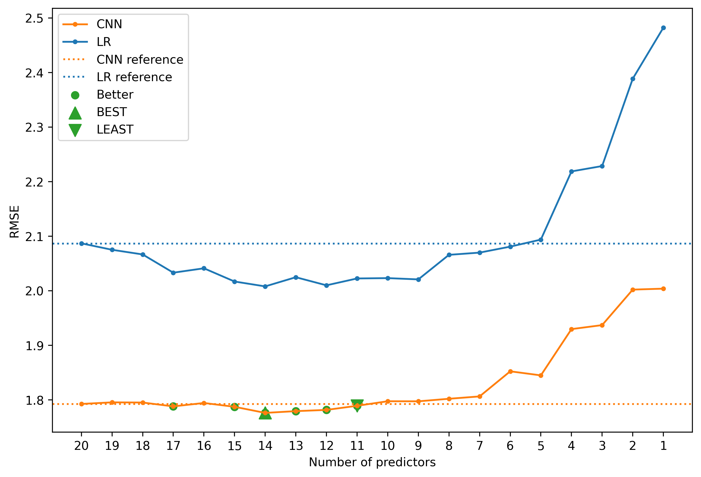
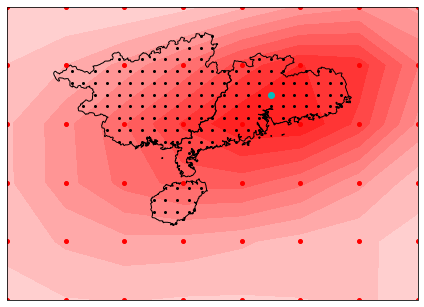
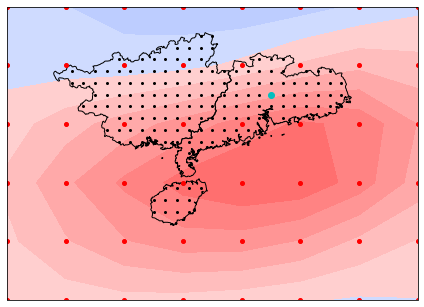
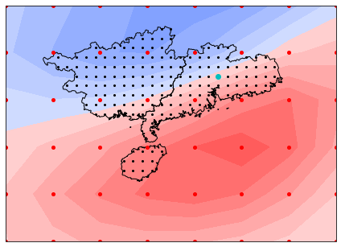
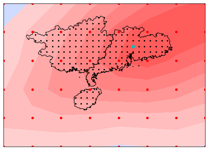
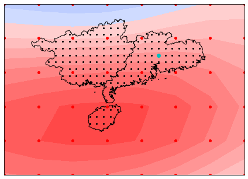
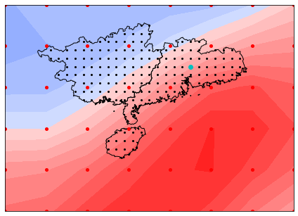

Predictor Selection for CNNs Inputting Stacked Variables
---

- [1. Quick start](#1-quick-start)
  - [1.1. Greedy elimination based on gradient-based importance metric or correlation coefficients](#11-greedy-elimination-based-on-gradient-based-importance-metric-or-correlation-coefficients)
- [2. Draw Results](#2-draw-results)
  - [2.1. Plot results using main_draw_scores.py](#21-plot-results-using-main_draw_scorespy)
    - [2.1.1. Predictor elimination](#211-predictor-elimination)
      - [2.1.1.1. Line plots](#2111-line-plots)
      - [2.1.1.2. Distribution and box plots of selected models](#2112-distribution-and-box-plots-of-selected-models)
    - [2.1.2. Reverse predictor elimination](#212-reverse-predictor-elimination)
    - [2.1.3. Predictor elimination according to *Correlation Coefficients*](#213-predictor-elimination-according-to-correlation-coefficients)
  - [2.2. Heatmaps plot results](#22-heatmaps-plot-results)
    - [2.2.1. Heatmaps of selected predictors at the grid of intrest](#221-heatmaps-of-selected-predictors-at-the-grid-of-intrest)
    - [2.2.2. Heatmaps of selected predictors at all grids (gifs)](#222-heatmaps-of-selected-predictors-at-all-grids-gifs)
- [3. Important scripts/modules/packages](#3-important-scriptsmodulespackages)
- [4. Key Python requirements](#4-key-python-requirements)

# 1. Quick start

Note: Clone the repository using `recursive` command
```
git clone --recursive git@github.com:yangdangfu/predictor_selection.git
```
or 
```
git clone --recursive https://github.com/yangdangfu/predictor_selection.git
```

## 1.1. Greedy elimination based on gradient-based importance metric or correlation coefficients
1. Prepare data
```
python main_data_preparation.py --region SC
```

Or download data from [TeraBox](https://terabox.com/s/16dzxGEaVFbd-1pMN0GRZDA) or [BaiduDisk](https://pan.baidu.com/s/1ZJlR-P5TJ9uzHTtMqMO6YQ?pwd=su6p). Put the download folder `DATA` under the project directory.

If the raw data is not well-prepared, the later option is better.

2. Run predictor elimination algorithm 
```
python main_select.py --reverse_sel False --multirun 10 --re_pred False --re_weight False --re_score False --region SC --model CNN10
```
3. Run reverse predictor elimination algorithm
```
python main_select.py --reverse_sel True --multirun 10 --re_pred False --re_weight False --re_score False --region SC --model CNN10
```
4. Run predictor elimination based on correlation analysis
```
python main_select_cc.py --reverse_sel False --multirun 10 --re_pred False --re_weight False --re_score False --region SC --model CNN10
```
5. Draw results
- draw results of GBP-based predictor elimination
```bash
python main_draw_scores.py --cc False --reverse_sel False --dset test --region SC --model CNN10 --multirun 10
python main_draw_scores.py --cc False --reverse_sel True --dset test --region SC --model CNN10 --multirun 10
```
- draw results of correlation-analysis-based predictor elimination
```bash
python main_draw_scores.py --cc True --reverse_sel False --dset test --region SC --model CNN10 --multirun 10
```
- draw heatmaps
```bash
python main_draw_grads.py
python main_draw_cc.py
```
All plots will be saved in folder `./IMAGES`.


Modify `--multirun 10` to `--multirun 1` for a quicker experiment, which will disable the multiple-run strategy. 

Modify the arguments `model` to `CNNdense`, `CNN1`, `CNN-FC`, `CNN-LM`, `CNN-PR` to run experiments using other models. 

Modify the arguments `region` to `Yangtze` to run experiments over reigon Yangtze River Basin. Note we also provide the well-prepared data for the region Yangtze in the given data download link. 

# 2. Draw Results
## 2.1. Plot results using [main_draw_scores.py](main_draw_scores.py)

### 2.1.1. Predictor elimination  
#### 2.1.1.1. Line plots
| RMSE                                                                                                 | CC                                                                                                   | ATCC                                                                                                 |
| ---------------------------------------------------------------------------------------------------- | ---------------------------------------------------------------------------------------------------- | ---------------------------------------------------------------------------------------------------- |
|  |  |  |

#### 2.1.1.2. Distribution and box plots of selected models
| RMSE                                                                                                     | CC                                                                                                     | ATCC                                                                                                     |
| -------------------------------------------------------------------------------------------------------- | ------------------------------------------------------------------------------------------------------ | -------------------------------------------------------------------------------------------------------- |
|  |  |  |

ATCC & bias & box plots of bias
|                                                                                                        |                                                                                                                |
| ------------------------------------------------------------------------------------------------------ | -------------------------------------------------------------------------------------------------------------- |
|  |  |

### 2.1.2. Reverse predictor elimination  

| RMSE                                                                                                | CC                                                                                                  | ATCC                                                                                                |
| --------------------------------------------------------------------------------------------------- | --------------------------------------------------------------------------------------------------- | --------------------------------------------------------------------------------------------------- |
|  |  |  |

### 2.1.3. Predictor elimination according to *Correlation Coefficients*
| RMSE                                                                                                      | CC                                                                                                        | ATCC                                                                                                      |
| --------------------------------------------------------------------------------------------------------- | --------------------------------------------------------------------------------------------------------- | --------------------------------------------------------------------------------------------------------- |
|  |  |  |

## 2.2. Heatmaps plot results 
> using [main_draw_grads.py](./main_draw_grads.py) and [main_draw_cc.py](./main_draw_cc.py)

### 2.2.1. Heatmaps of selected predictors at the grid of intrest
See [IMAGES_SAVED/GRADS/](IMAGES_SAVED/GRADS/) and [IMAGES_SAVED/CORR/](IMAGES_SAVED/CORR/) for heatmaps (.png) of more predictors
| GRAD |  |  |  |
| ---- | ------------------------------------------------------------------------------- | ------------------------------------------------------------------------------- | -------------------------------------------------------------------------------- |
| CC   |                     |                     |                     |
|      | shum500                                                                         | uwnd500                                                                         | vwnd1000                                                                         |

### 2.2.2. Heatmaps of selected predictors at all grids (gifs)
See [IMAGES_SAVED/GRADS/](IMAGES_SAVED/GRADS/) and [IMAGES_SAVED/CORR/](IMAGES_SAVED/CORR/) for heatmaps (.gif)) of more predictors
| GRAD |  |  |  |
| ---- | --------------------------------------------------------------------------- | --------------------------------------------------------------------------- | ---------------------------------------------------------------------------- |
| CC   |                     |                     |                     |
|      | shum500                                                                     | uwnd500                                                                     | vwnd1000                                                                     |

# 3. Important scripts/modules/packages
Note: Scripts are the main entry of the programs that can perform certain tasks, such as `main_data_preparation.py` can be executed to prepare data; `main_train.py` is used to train the models without multiple-run; 'main_multirun.py' wraps `main_train.py` and `main_eval.py` to perform model train & evaluation with multiple-run support.
- Data preparation
    - [data_utils](data_utils/readme.md): packages for downloading, loading raw data and other processes
    - [main_data_preparation.py](main_data_preparation.py): script to load data for given regions
- Utilities
  - [utils.preprocessing.py](utils/preprocessing.py): data preprocessing and anti-processing functions
  - [utils/dataset_splits.py](utils/dataset_splits.py): module to perform dataset split
  - [utils/get_rundirs.py](utils/get_rundirs.py): functions to fetch the directories according to given parameters (the trained models of different parameters are saved in directories in a regular way)
  - [utils/cli_utils.py](utils/cli_utils.py): defined a function to check required argument list in CLI
- Selector
  - [selector.predictor_selector.py](selector/predictor_selector.py): predictor selector
- CNN model
  - [dataloader.py](dataloader.py): dataloader module for Pytorch training
  - [model_wrapper.py](model_wrapper.py): module to wrap all CNN archs together with pytorch_lightning
  - [trainer.py](trainer.py): module to train the CNN, implementing based on pytorch_lightning and hydra
  - [main_train.py](main_train.py): Script of CLI that execute CNN trainer with given parameters
  - [predict.py](predict.py): A module to run prediction on given raw input data, as well as model and its metadata
  - [score.py](score.py): A module to compute scores of prediction
  - [weights_attribution.py](weights_attribution.py): Module to attribute weights to different predictors
  - [main_eval.py](main_eval.py): Script to run prediction, evaluation and other processes for trained CNN models, all intermediate results will be saved for latter use
  - [main_multirun.py](main_multirun.py): Script for multiple-run strategy, that is run the training and evaluation for multiple times
- Linear regression
  - [predict_ml.py](predict_ml.py): Module to predict and combine grid-wise predictions using linear regression models
  - [main_ml.py](main_ml.py): Script for fitting, prediction, evaluation of linear regression models
- Program
  - [main_select.py](main_select.py): Script CLI wrapping all the routines of predictor selection on CNNs
  - [main_select_cc.py](main_select_cc.py): Script CLI wrapping all the routines of predictor selection using correlation analysis method on CNNs
- Plot
  - `plots` package
    - [plots/agg_scores.py](plots/agg_scores.py): Module for aggregating and averaging scores over models of multiple-run.
    - [plots/draw_boxplot.py](plots/draw_boxplot.py): Module for drawing box plots
    - [plots/draw_dist.py](plots/draw_dist.py): Module for drawing geographic distribution
  - [main_draw_scores.py](main_draw_scores.py): Script for drawing RMSE, ATCC, CC scores in line, distribution and box plots.
  - [main_draw_grads.py](main_draw_grads.py): Script for drawing heatmaps of gradients of predictors, the results are .png and .gif images.
  - [main_draw_cc.py](main_draw_cc.py): Script for drawing heatmaps of correlation coefficients between predictors and grid precipitation, the results are .png and .gif images.

The K-fold cross-validation is implemented in [train](main_train.py) and [eval](main_eval.py) processes. 

The Multiple-run strategy is implemented in [main_multirun.py](main_multirun.py) by executing the train and eval multiple times. Automatic runs counting is supported. 

# 4. Key Python requirements
- Anaconda (numpy, pandas, etc.)
- hydra-core
- xarray
- pytorch
- pytorch-lightning  
- fire
- coloredlogs, prettytabble
- xskillscore
- cmaps
- geopandas