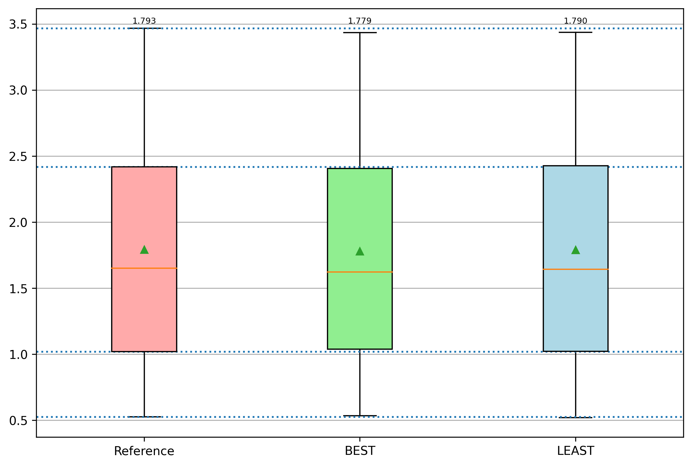
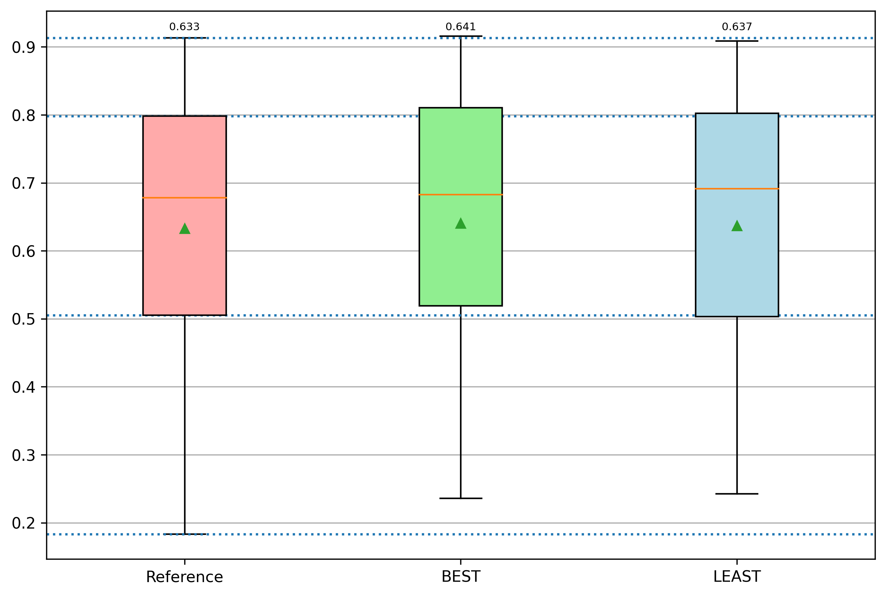
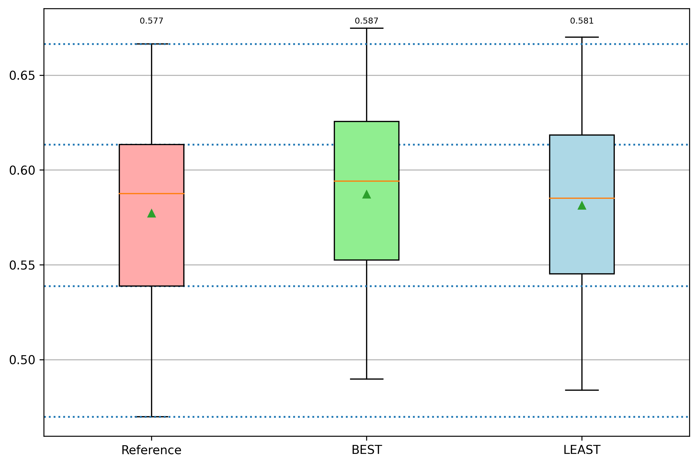
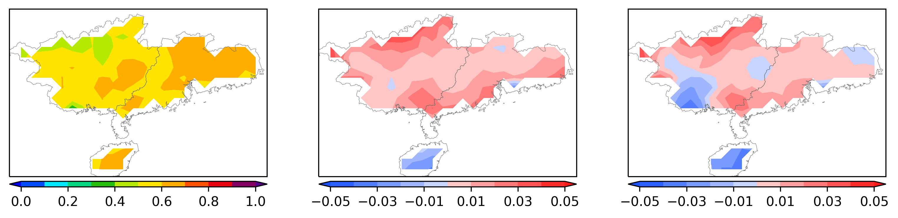
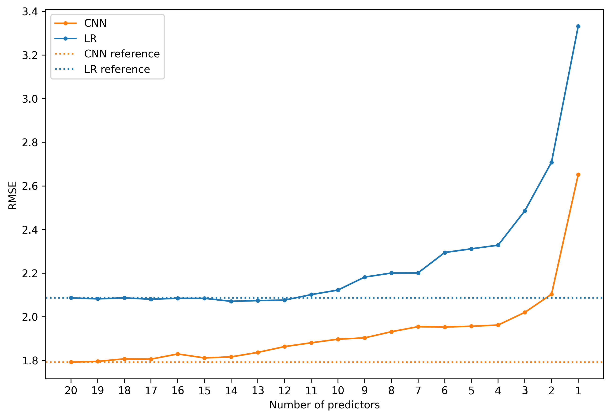

Predictor Selection for CNNs Inputting Stacked Variables
---

- [1. Work-in-progress Statement:](#1-work-in-progress-statement)
- [2. Quick reproduction](#2-quick-reproduction)
  - [2.1. Reproduce the greedy elimination based on gradient-based importance metric](#21-reproduce-the-greedy-elimination-based-on-gradient-based-importance-metric)
  - [2.2. Reproduce the greedy elimination based on correlation analysis](#22-reproduce-the-greedy-elimination-based-on-correlation-analysis)
- [3. Important scripts/modules/packages](#3-important-scriptsmodulespackages)
- [4. Plots](#4-plots)
  - [4.1. Plot results using main_draw_scores.py](#41-plot-results-using-main_draw_scorespy)
    - [4.1.1. Predictor elimination](#411-predictor-elimination)
      - [4.1.1.1. Line plots](#4111-line-plots)
      - [4.1.1.2. Distribution and box plots of selected models](#4112-distribution-and-box-plots-of-selected-models)
    - [4.1.2. Reverse predictor elimination](#412-reverse-predictor-elimination)
    - [Predictor elimination according to *Correlation Coefficients*](#predictor-elimination-according-to-correlation-coefficients)
- [5. Key Python requirements](#5-key-python-requirements)

# 1. Work-in-progress Statement:
    
The repository is working in progress, organizing and migrating the code from original implementations. 

# 2. Quick reproduction
## 2.1. Reproduce the greedy elimination based on gradient-based importance metric
1. Prepare data
```
python main_data_preparation.py --region SC
```

Or download data from [TeraBox](https://terabox.com/s/16dzxGEaVFbd-1pMN0GRZDA) or [BaiduDisk](https://pan.baidu.com/s/1ZJlR-P5TJ9uzHTtMqMO6YQ?pwd=su6p). Put the download folder `DATA` under the project directory.

If the raw data is not well-prepared, the later option is better.

2. Run predictor elimination algorithm 
```
python main_select.py --reverse_sel False --multirun 10 --re_pred False --re_weight False --re_score False --region SC --model CNN10
```
3. Run reverse predictor elimination algorithm
```
python main_select.py --reverse_sel True --multirun 10 --re_pred False --re_weight False --re_score False --region SC --model CNN10
```
4. Draw results
```
python main_draw_scores.py --region SC --model CNN10 --multirun 10
```
The last drawing command will plot all the experimental scores in folder `./IMAGES`.

Modify `--multirun 10` to `--multirun 1` for a quicker experiment, which will disable the multiple-run strategy. 

Modify the arguments `model` to `CNNdense`, `CNN1`, `CNN-FC`, `CNN-LM`, `CNN-PR` to run experiments using other models. 
## 2.2. Reproduce the greedy elimination based on correlation analysis
...

# 3. Important scripts/modules/packages
Note: Scripts are the main entry of the programs that can perform certain tasks, such as `main_data_preparation.py` can be executed to prepare data; `main_train.py` is used to train the models without multiple-run; 'main_multirun.py' wraps `main_train.py` and `main_eval.py` to perform model train & evaluation with multiple-run support.
- Data preparation
    - [data_utils](data_utils/readme.md): packages for downloading, loading raw data and other processes
    - [main_data_preparation.py](main_data_preparation.py): script to load data for given regions
- Utilities
  - [utils.preprocessing.py](utils/preprocessing.py): data preprocessing and anti-processing functions
  - [utils/dataset_splits.py](utils/dataset_splits.py): module to perform dataset split
  - [utils/get_rundirs.py](utils/get_rundirs.py): functions to fetch the directories according to given parameters (the trained models of different parameters are saved in directories in a regular way)
  - [utils/cli_utils.py](utils/cli_utils.py): defined a function to check required argument list in CLI
- Selector
  - [selector.predictor_selector.py](selector/predictor_selector.py): predictor selector
- CNN model
  - [dataloader.py](dataloader.py): dataloader module for Pytorch training
  - [model_wrapper.py](model_wrapper.py): module to wrap all CNN archs together with pytorch_lightning
  - [trainer.py](trainer.py): module to train the CNN, implementing based on pytorch_lightning and hydra
  - [main_train.py](main_train.py): Script of CLI that execute CNN trainer with given parameters
  - [predict.py](predict.py): A module to run prediction on given raw input data, as well as model and its metadata
  - [score.py](score.py): A module to compute scores of prediction
  - [weights_attribution.py](weights_attribution.py): Module to attribute weights to different predictors
  - [main_eval.py](main_eval.py): Script to run prediction, evaluation and other processes for trained CNN models, all intermediate results will be saved for latter use
  - [main_multirun.py](main_multirun.py): Script for multiple-run strategy, that is run the training and evaluation for multiple times
- Linear regression
  - [predict_ml.py](predict_ml.py): Module to predict and combine grid-wise predictions using linear regression models
  - [main_ml.py](main_ml.py): Script for fitting, prediction, evaluation of linear regression models
- Program
  - [main_select.py](main_select.py): Script CLI wrapping all the routines of predictor selection on CNNs
  - [main_select_cc.py](main_select_cc.py): Script CLI wrapping all the routines of predictor selection using correlation analysis method on CNNs
- Plot
  - `plots` package
    - [plots/agg_scores.py](plots/agg_scores.py): Module for aggregating and averaging scores over models of multiple-run.
    - [plots/draw_boxplot.py](plots/draw_boxplot.py): Module for drawing box plots
    - [plots/draw_dist.py](plots/draw_dist.py): Module for drawing geographic distribution
  - [main_draw_scores.py](main_draw_scores.py): Script for drawing RMSE, ATCC, CC scores in line, distribution and box plots.

The K-fold cross-validation is implemented in [train](main_train.py) and [eval](main_eval.py) processes. 

The Multiple-run strategy is implemented in [main_multirun.py](main_multirun.py) by executing the train and eval multiple times. Automatic runs counting is supported. 

# 4. Plots 
## 4.1. Plot results using [main_draw_scores.py](main_draw_scores.py)

### 4.1.1. Predictor elimination  
#### 4.1.1.1. Line plots
| RMSE                                                                                                 | CC                                                                                                   | ATCC                                                                                                 |
| ---------------------------------------------------------------------------------------------------- | ---------------------------------------------------------------------------------------------------- | ---------------------------------------------------------------------------------------------------- |
|  |  |  |

#### 4.1.1.2. Distribution and box plots of selected models
| RMSE                                                                                                     | CC                                                                                                     | ATCC                                                                                                     |
| -------------------------------------------------------------------------------------------------------- | ------------------------------------------------------------------------------------------------------ | -------------------------------------------------------------------------------------------------------- |
|  |  |  |

ATCC & bias & box plots of bias
|                                                                                                        |                                                                                                                |
| ------------------------------------------------------------------------------------------------------ | -------------------------------------------------------------------------------------------------------------- |
|  |  |

### 4.1.2. Reverse predictor elimination  

| RMSE                                                                                                | CC                                                                                                  | ATCC                                                                                                |
| --------------------------------------------------------------------------------------------------- | --------------------------------------------------------------------------------------------------- | --------------------------------------------------------------------------------------------------- |
|  |  |  |

### Predictor elimination according to *Correlation Coefficients*
| RMSE                                                                                                      | CC                                                                                                        | ATCC                                                                                                      |
| --------------------------------------------------------------------------------------------------------- | --------------------------------------------------------------------------------------------------------- | --------------------------------------------------------------------------------------------------------- |
|  |  |  |

# 5. Key Python requirements
- Anaconda (numpy, pandas, etc.)
- hydra-core
- xarray
- pytorch
- pytorch-lightning  
- fire
- coloredlogs, prettytabble
- xskillscore
- cmaps
- geopandas